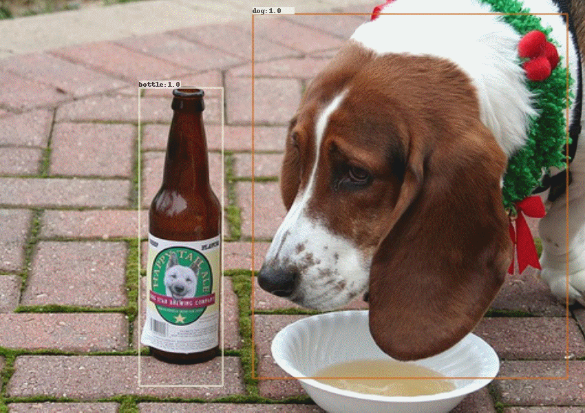
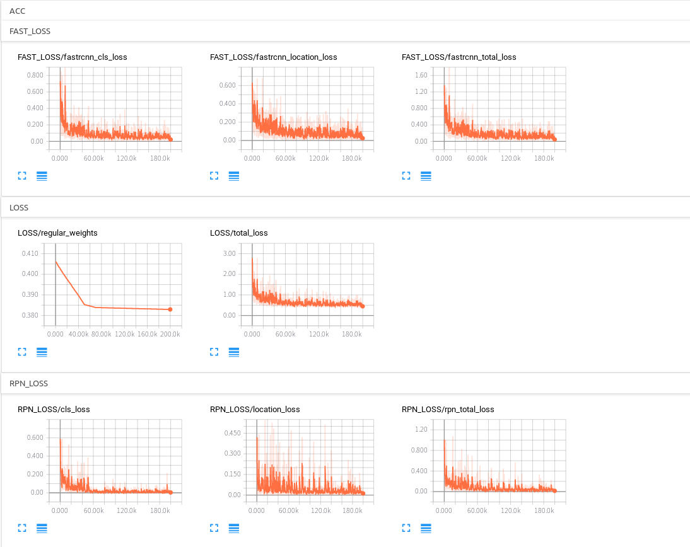
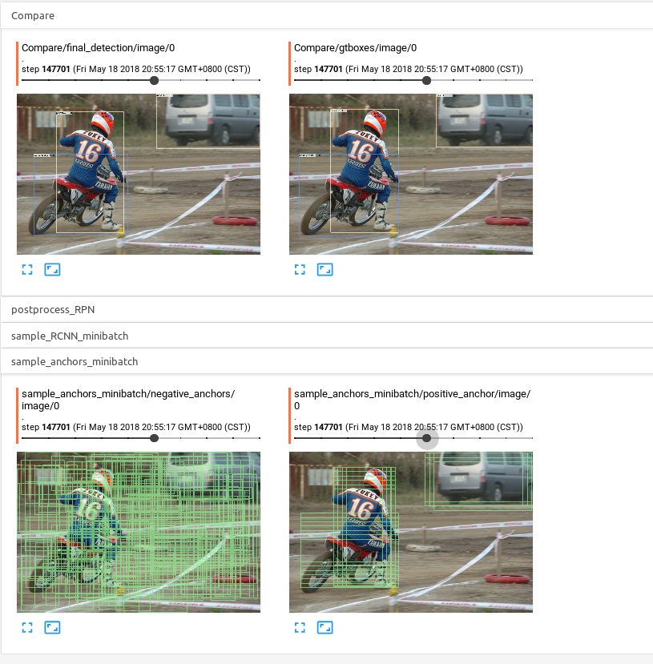

# R-FCN_Tensorflow (Development Version)

## Abstract
This is a tensorflow re-implementation of [R-FCN: Object Detection via Region-based Fully Convolutional Networks](https://arxiv.org/abs/1605.06409).     

This project is completed by [YangXue](https://github.com/yangxue0827) and [YangJirui](https://github.com/yangJirui).

## Train on VOC 2007 trainval and test on VOC 2007 test    


## Comparison
| Models | mAP | sheep | horse | bicycle | bottle | cow | sofa | bus | dog | cat | person | train | diningtable | aeroplane | car | pottedplant | tvmonitor | chair | bird | boat | motorbike |
|------------|:---:|:--:|:--:|:--:|:---:|:--:|:--:|:--:|:--:|:--:|:--:|:---:|:--:|:--:|:--:|:--:|:---:|:--:|:--:|:--:|:--:|
|resnet101_v1|72.33|73.32|80.55|81.45|52.44|77.50|74.45|82.45|83.77|85.15|79.82|82.05|63.21|77.12|84.42|38.43|71.72|49.44|72.86|56.56|80.09|

## Requirements
1、tensorflow >= 1.2     
2、cuda8.0     
3、python2.7 (anaconda2 recommend)    
4、[opencv(cv2)](https://pypi.org/project/opencv-python/)    

## Download Model
1、please download [resnet50_v1](http://download.tensorflow.org/models/resnet_v1_50_2016_08_28.tar.gz)、[resnet101_v1](http://download.tensorflow.org/models/resnet_v1_101_2016_08_28.tar.gz) pre-trained models on Imagenet, put it to $PATH_ROOT/data/pretrained_weights.     
2、please download [mobilenet_v2](https://storage.googleapis.com/mobilenet_v2/checkpoints/mobilenet_v2_1.0_224.tgz) pre-trained model on Imagenet, put it to $PATH_ROOT/data/pretrained_weights/mobilenet.     

## Data Format
```
├── VOCdevkit
│   ├── VOCdevkit_train
│       ├── Annotation
│       ├── JPEGImages
│   ├── VOCdevkit_test
│       ├── Annotation
│       ├── JPEGImages
```

## Compile
```  
cd $PATH_ROOT/libs/box_utils/cython_utils
python setup.py build_ext --inplace
```

## Eval
```  
cd $PATH_ROOT/tools
python eval.py --eval_imgs='/PATH/TO/IMAGES/'  
               --annotation_dir='/PATH/TO/TEST/ANNOTATION/'
               --GPU='0'
```

## Train

1、If you want to train your own data, please note:  
```     
(1) Modify parameters (such as CLASS_NUM, DATASET_NAME, VERSION, etc.) in $PATH_ROOT/libs/configs/cfgs.py
(2) Add category information in $PATH_ROOT/libs/label_name_dict/lable_dict.py     
(3) Add data_name to line 76 of $PATH_ROOT/data/io/read_tfrecord.py 
```     

2、make tfrecord
```  
cd $PATH_ROOT/data/io/  
python convert_data_to_tfrecord.py --VOC_dir='/PATH/TO/VOCdevkit/VOCdevkit_train/' 
                                   --xml_dir='Annotation'
                                   --image_dir='JPEGImages'
                                   --save_name='train' 
                                   --img_format='.jpg' 
                                   --dataset='pascal'
```     

3、train
```  
cd $PATH_ROOT/tools
python train.py
```

## Tensorboard
```  
cd $PATH_ROOT/output/summary
tensorboard --logdir=.
``` 



## Reference
1、https://github.com/endernewton/tf-faster-rcnn   
2、https://github.com/zengarden/light_head_rcnn   
3、https://github.com/tensorflow/models/tree/master/research/object_detection
